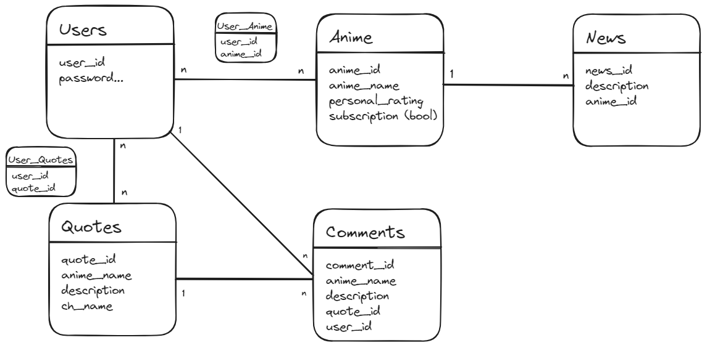

## Documentazione del Progetto: Sito Web Anime-Nikki

### Introduzione

Il progetto Anime-Nikki è un sito web progettato per gli amanti degli anime e manga che desiderano tenere traccia dei propri show preferiti e scoprire nuove serie. Lo scopo del sito è fornire agli utenti un'interfaccia intuitiva per creare un diario degli anime, aggiungere recensioni e partecipare a discussioni sulla cultura anime.

### Tecnologie Utilizzate

- **Linguaggi di programmazione**: HTML, CSS, JavaScript, Python
- **Framework**: Flask (Python), Bootstrap (CSS)
- **Database**: SQLite
- **Strumenti**: Git, GitHub, PythonAnywhere

### Architettura del Sistema

Il sito Anime-Nikki segue un'architettura basata sul modello MVC (Model-View-Controller), che suddivide l'applicazione in tre componenti principali:

- **Model**: Rappresenta la struttura dei dati del sito, gestendo il recupero e la manipolazione delle informazioni nel database.
  
- **View**: Gestisce la presentazione dell'interfaccia utente, utilizzando HTML, CSS e JavaScript per renderizzare le pagine web e interagire con l'utente.
  
- **Controller**: Coordina le interazioni tra il modello e la vista, gestendo le richieste dell'utente e aggiornando lo stato dell'applicazione di conseguenza. In questo progetto, il controller è implementato con Flask, che gestisce il routing delle richieste HTTP.

La struttura delle directory del progetto è organizzata come segue:

```
anime-nikki/
│
├── static/    (contiene file statici come CSS e JavaScript)
│   ├── css/
│   └── js/
│
├── templates/    (contiene i file HTML delle pagine del sito)
│   ├── home.html
│   └── ...
│
├── app.py    (file principale dell'applicazione Flask)
├── database.py    (definizione del database e operazioni CRUD)
└── ...
```

### Database

L'idea iniziale era la seguente:



Lo schema del database per Anime-Nikki comprende le seguenti tabelle:

- **Utenti**: Contiene informazioni sugli utenti registrati, come nome utente, password, data di creazione e miglior punteggio della sezione di gioco.
  
- **Anime**: Memorizza i dettagli degli anime, prendendo solamente l'ID, sfruttando l'API di AniList/AniChart.

- **Manga**: Memorizza i dettagli dei manga, prendendo solamente l'ID, sfruttando l'API di AniList/AniChart.

- **Quotes**: Memorizza i dettagli della quote giornaliera, prendendo ID, titolo dell'anime, nome del personaggio e frase, sfruttando l'API di Animechan.
  
- **Preferiti**: Consente agli utenti di salvare in una sezione apposita i propri anime preferiti.

Le relazioni tra le tabelle sono gestite tramite chiavi primarie e esterne per garantire l'integrità referenziale.

### Sviluppo del Software

Il processo di sviluppo del software per Anime-Nikki ha seguito un approccio agile, con iterazioni frequenti e adattative. Sono state utilizzate le user stories per identificare i requisiti e guidare lo sviluppo delle funzionalità chiave del sito. Gli issue di GitHub sono stati impiegati per tracciare le attività e garantire un progresso costante.

### User Stories e Requisiti

Di seguito sono elencate alcune delle user stories principali identificate durante l'analisi preliminare:

1. **Come utente, voglio poter aggiungere anime al mio diario personale.**
   - Criteri di accettazione: L'utente può aggiungere un anime/manga alla propria lista personale e visualizzarlo in un elenco separato. Stessa cosa per le quotes.

### Documentazione del Codice

Il codice sorgente è documentato con commenti chiari e descrittivi per facilitare la comprensione e la manutenzione. In particolare, sono stati aggiunti commenti per spiegare la logica di funzionamento delle funzioni e dei metodi, nonché per descrivere la struttura dei file e delle classi.

### Deploy e Manutenzione

Dopo il completamento dello sviluppo, il sito è stato deployato su PythonAnywhere seguendo le istruzioni fornite dalla piattaforma. Tutte le dipendenze sono state installate correttamente e il sito è stato configurato per l'ambiente di produzione. Attualmente, il sito è accessibile tramite l'URL pubblico [www.anime-nikki.com](www.anime-nikki.com).

### Conclusioni

Il progetto Anime-Nikki ha fornito un'esperienza di apprendimento significativa nell'ambito dello sviluppo web e delle pratiche di sviluppo agile. Attraverso l'analisi preliminare, la progettazione del database e l'implementazione del sito, sono state acquisite competenze cruciali per la creazione di applicazioni web robuste e user-friendly dedicate agli appassionati di anime.
